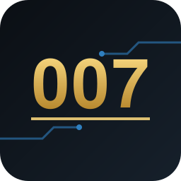

<p align="center"></p>

# 007 — Xbox 360 recompilation

The Xbox 360 James Bond games, statically recompiled to native Windows PC
executables with [ReXGlue](https://github.com/furqanagwan/rexglue-sdk):
Direct3D 12 rendering, native input and audio, and an optional Microsoft GDK
build.

> [!IMPORTANT]
> This repository contains no game files. You need your own legally obtained
> copy of each game. Disc images, extracted files, generated code, builds,
> saves and logs stay on your machine.

## Games

| Game | Released | Disc (Redump name) | Region | Languages | Title ID | Media ID | Executable | Status |
| --- | --- | --- | --- | --- | --- | --- | --- | --- |
| Quantum of Solace | 2008 · Treyarch | `007 - Quantum of Solace (USA, Europe) (En,Fr)` | USA and Europe, one disc; the XEX is region-free | English, French | `415607FF` | `06DD88A0` | `default.xex` v7, disc 1/1, no title update | **In-game** |
| Blood Stone | 2010 · Bizarre Creations | `007 - Blood Stone (USA, Europe) (En,Fr,De)` | USA and Europe, one disc | English, French, German | `4156081F` | `42DBE473` | `default.xex` v2, disc 1/1, no title update | **Investigating** |
| 007 Legends | 2012 · Eurocom | `007 Legends (USA, Europe) (En,Fr,De)` | USA and Europe, one disc | English, French, German | `415608D8` | `5B1FDAF8` | `Default.xex` v4, disc 1/1, no title update | **Investigating** |

Each game's window shows the game's own name and its Xbox 360 dashboard icon.

**Status levels:**

- **Planned:** not started.
- **Investigating:** recompiles, but doesn't reach gameplay yet.
- **In-game:** reaches gameplay, but not validated end to end.
- **Playable:** validated through the game, within the limits listed.

## Quantum of Solace status

**What works** on an NVIDIA RTX 5080 Laptop GPU, with ReXGlue `main` `0d7568a`:

- **Boot to the first level:** it boots from the publisher logos to the first
  level, with textured 3D, the HUD and mission objectives.
- **Achievements:** the first achievement unlocks.
- **Input:** a controller works through GameInput in GDK builds, or XInput
  otherwise. Keyboard input hasn't been confirmed.
- **Audio:** plays through XAudio2.
- **Soak test:** 90-second runs have zero error lines in both the standard and
  the GDK build ([SDK baseline record](https://github.com/furqanagwan/rexglue-sdk/blob/main/docs/baseline-capture.md)).

**Not validated yet** ([#16](https://github.com/furqanagwan/007/issues/16)):

- a full playthrough;
- saving and loading;
- visual accuracy against a real console;
- AMD and Intel GPUs.

**Multiplayer:** not recompiled (`default_mp.xex`).

**How it got here:** the boot needed guest function entries the recompiler
couldn't find on its own. [`configs/quantumofsolace.toml`](configs/quantumofsolace.toml)
adds them, and the records for [RG-007-001](docs/RG-007-001.md) to
[RG-007-004](docs/RG-007-004.md) trace each one.

## Blood Stone and 007 Legends status

**What works** on an NVIDIA RTX 5080 Laptop GPU, with ReXGlue `main` `bc2a70e`
([RG-007-006](docs/RG-007-006.md)):

- **Recompiles without title hints:** neither game needs a file in `configs/`.
- **Boots to the front end:** 90-second GDK runs of each reach its animated
  front end with no error lines. A controller connects and XAudio2 plays.

**Not validated yet:** starting a mission, gameplay, saving and loading,
visual accuracy, AMD and Intel GPUs, and the standard (non-GDK) build.

## Requirements

- **Your own copy of the game:** the disc listed above. Check that its title
  and media IDs match.
- **Windows 11 x64 and a Direct3D 12 GPU.** Only NVIDIA has been tested.
- **The build tools:** Visual Studio 2026 with LLVM Clang, CMake and Ninja, as
  listed in the [SDK README](https://github.com/furqanagwan/rexglue-sdk#requirements).
- **The ReXGlue SDK** from [furqanagwan/rexglue-sdk](https://github.com/furqanagwan/rexglue-sdk),
  built and installed from `main` `bc2a70e` or later.
- **Optional:** Microsoft GDK 260404, for the GDK build (GameInput, XAudio2,
  the Gaming Runtime and MSIXVC packaging).

## Build a game

| Game | Folder | Project name | Executable | Title configuration |
| --- | --- | --- | --- | --- |
| Quantum of Solace | `Quantum of Solace/` | `quantumofsolace` | `default.xex` | `configs/quantumofsolace.toml` |
| Blood Stone | `Blood Stone/` | `bloodstone` | `default.xex` | none |
| 007 Legends | `Legends/` | `legends` | `Default.xex` | none |

Keep everything in the game's folder next to this repository, which is
ignored. The steps use Blood Stone; substitute the row for another game.

1. **Extract the files** from your disc image into `Blood Stone/game/`, for
   example with [extract-xiso](https://github.com/XboxDev/extract-xiso).
2. **Create the project:**

   ```powershell
   rexglue init --project-name bloodstone --xex-path "Blood Stone/game/default.xex" --game-root "Blood Stone/game" --project-root "Blood Stone/recompiled"
   ```

3. **Quantum of Solace and 007 Legends: add the title configuration** to the
   entry point's `includes` in the manifest. The path is relative to that file:

   ```toml
   includes = ["../../configs/quantumofsolace.toml"]   # quantumofsolace_manifest.toml
   includes = ["../../configs/legends.toml"]           # legends_manifest.toml
   ```

   Both carry switchable cheats from the Aurora trainer pack, turned on and off
   in the Xbox guide's Settings > Cheats ([RG-007-010](docs/RG-007-010.md)).

   For up to 60 FPS, include `quantumofsolace-60fps.toml` instead. It switches
   on Canary's "Unlock FPS" patch, which Canary warns can softlock certain
   missions ([RG-007-008](docs/RG-007-008.md)). The patch is switchable: with
   an SDK that has the Xbox guide (RG-GDK-041), turn it on or off while playing
   in the guide's Settings > Patches; the choice is saved.

4. **Generate and build** against the installed SDK:

   ```powershell
   cd "Blood Stone/recompiled"
   rexglue codegen
   cmake -S . -B out/build/release -G Ninja -DCMAKE_BUILD_TYPE=Release -DCMAKE_C_COMPILER=clang -DCMAKE_CXX_COMPILER=clang++ -DCMAKE_PREFIX_PATH=<ReXGlue install prefix>
   cmake --build out/build/release
   ```

   For the GDK build, use the SDK's GDK install prefix (`out/install/win-amd64-gdk`).

5. **Run it:**

   ```powershell
   .\out\build\release\bloodstone.exe --game_data_root="<...>/Blood Stone/game" --user_data_root="<...>/Blood Stone/saves" --gpu_plugin=xenos
   ```

   Input, audio and the window use the native backends by default.

## Repository layout

```text
assets/                            Original artwork (logo, social preview)
configs/quantumofsolace.toml       Quantum of Solace codegen: function entries, patches
configs/quantumofsolace-60fps.toml The same with the 60 FPS patch switched on
docs/RG-007-NNN.md                 One record per issue: goal, evidence, result
```

Everything else in the folder is ignored (`.gitignore` is an allowlist).

## Issues and records

- **Tracking:** work is tracked as [issues](https://github.com/furqanagwan/007/issues)
  with IDs `RG-007-NNN`. Each has a record in `docs/`, with the tested
  executable's hashes, the SDK commit, the hardware and what was and wasn't
  checked.
- **Where fixes go:** fixes that help every title go to
  [rexglue-sdk](https://github.com/furqanagwan/rexglue-sdk). Only what's
  specific to one of these games belongs here.
- **Standard:** this repository follows the
  [title repository standard](https://github.com/furqanagwan/rexglue-sdk/blob/main/docs/title-repo-standard.md).

## Legal

007, James Bond and the game titles are trademarks of their respective owners.
This is an independent preservation and research project, not affiliated with
or endorsed by them. It contains no game code or assets, and the artwork in
`assets/` is original.

## Credits

- [ReXGlue](https://github.com/rexglue/rexglue-sdk), the static recompilation
  SDK this builds on, and its authors.
- [Xenia](https://github.com/xenia-project/xenia),
  [Xenia Canary](https://github.com/xenia-canary/xenia-canary) and
  [Xenia Edge](https://github.com/has207/xenia-edge), whose Xbox 360 research
  the runtime draws on.
